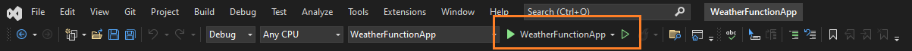
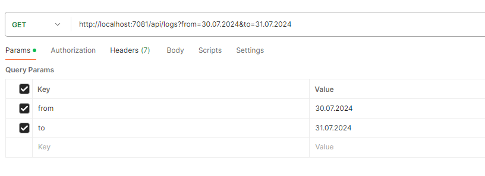
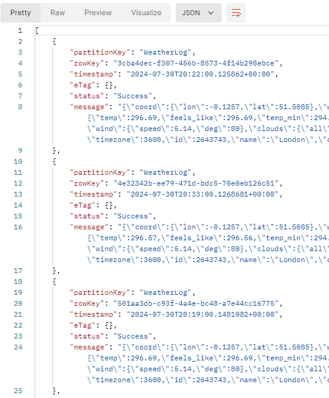
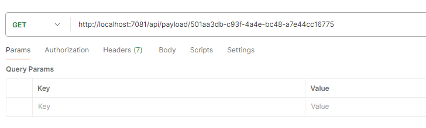
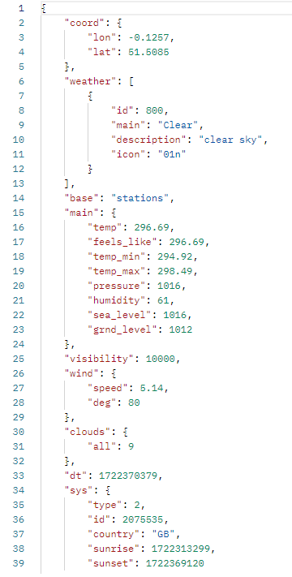
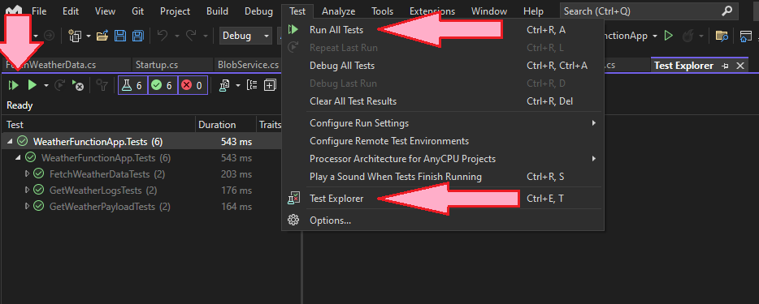

# WeatherFunctionApp

An `Azure Function` .NET Core 6 application which:

- Every minute, fetches data from https://api.openweathermap.org/data/2.5/weather?q=London&appid=YOUR_API_KEY and store success/failure attempt log in the table and full payload in the blob.
- Has a GET API for the specific time period (from/to): queries the Azure Table Storage and returns logs within the specified time period.
- Has GET API call to fetch a payload from blob for the specific log entry.

Before you start:

- Register [openweathermap.org](https://openweathermap.org) and get your `api key`
  - :exclamation: or modify my project for your needs.
- Go to `WeatherFunctionApp\WeatherFunctionApp\WeatherFunctionApp`
  - Add `local.settings.json` file
    - ````
        {
          "IsEncrypted": false,
          "Values": {
            "AzureWebJobsStorage": "UseDevelopmentStorage=true",
            "FUNCTIONS_WORKER_RUNTIME": "dotnet",
            "OpenWeatherMapApiKey": "your_api_key"
          }
        }```
      ````
- https://learn.microsoft.com/en-us/azure/azure-functions/functions-overview?pivots=programming-language-csharp
- [More about `local.settings.json` file](https://learn.microsoft.com/en-us/azure/azure-functions/functions-develop-local)

1. Open and run project with capable IDE of your choice. I used Visual Studio in example below.



- Test 2 endpoints using Postman or other software:
  - 'http://localhost:7081/api/logs?from=30.07.2000&to=31.07.2050' React frotend
  - 'http://localhost:7081/api/payload/{your_real_guid_payload_id}' -> WeatherData

<h3>api/logs?from=30.07.2000&to=31.07.2050</h3>




<h3>api/payload/{your_real_guid_payload_id}</h3>




2. To run tests see picture below (`Test` -> `Run All Tests`).



## If you have trouble launching project. See information below.

## :exclamation::exclamation::exclamation: Download and install :exclamation::exclamation::exclamation:

Visualstudio <br>
https://visualstudio.microsoft.com/vs/

Azure Functions<br>
https://learn.microsoft.com/en-us/azure/azure-functions/functions-develop-vs?pivots=isolated

.NET 6.0 <br>
https://dotnet.microsoft.com/en-us/download

Postman <br>
https://www.postman.com

Azure Storage Explorer (OPTIONAL)<br>

- !! - Prerequisites: You must have a .NET 8 runtime installed (starting with Storage Explorer 1.34.0)<br>
  https://learn.microsoft.com/en-us/azure/storage/storage-explorer/vs-azure-tools-storage-manage-with-storage-explorer?tabs=windows

### To run your program:

If you are new to .NET visit [microsoft.com](https://dotnet.microsoft.com/en-us/learn)

1. You need to clone or download project from GitHub [project page](https://github.com/kristaps-m/WeatherFunctionApp)
2. You need the .NET Framework and an IDE (integrated development environment) to work with the C# language. [Try this page to get started.](https://www.simplilearn.com/c-sharp-programming-for-beginners-article)

- :exclamation::exclamation::exclamation: You will need data to work with :exclamation::exclamation::exclamation:
- :exclamation: In Visual Studio, Start project and wait data to be collected.
- now you should see data in your Azure Storage Explorer
- more information [learn.microsoft.com](https://learn.microsoft.com/en-us/ef/core/cli/powershell)
